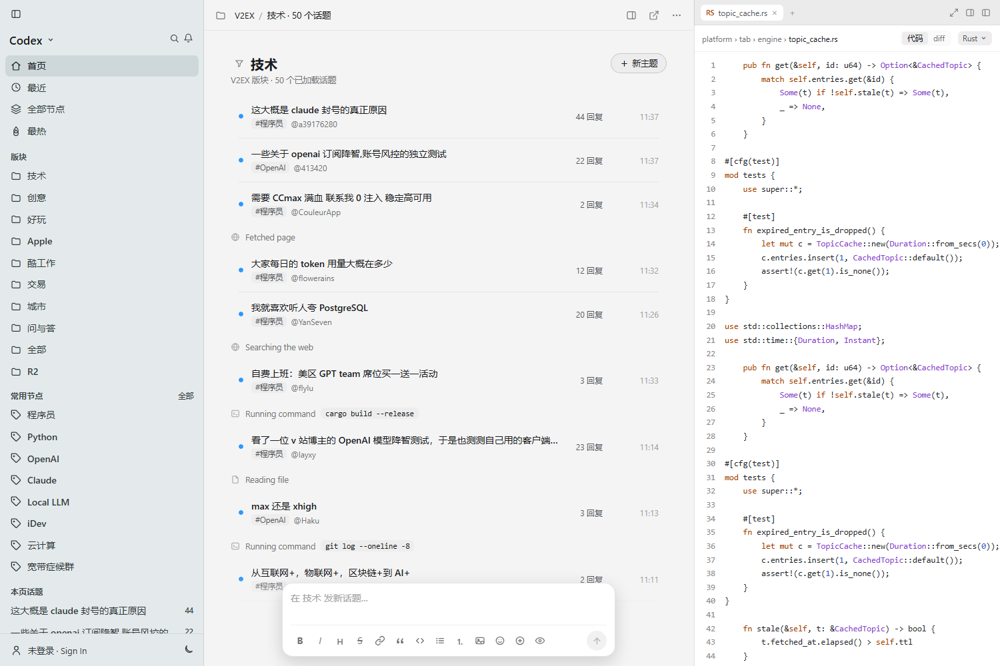
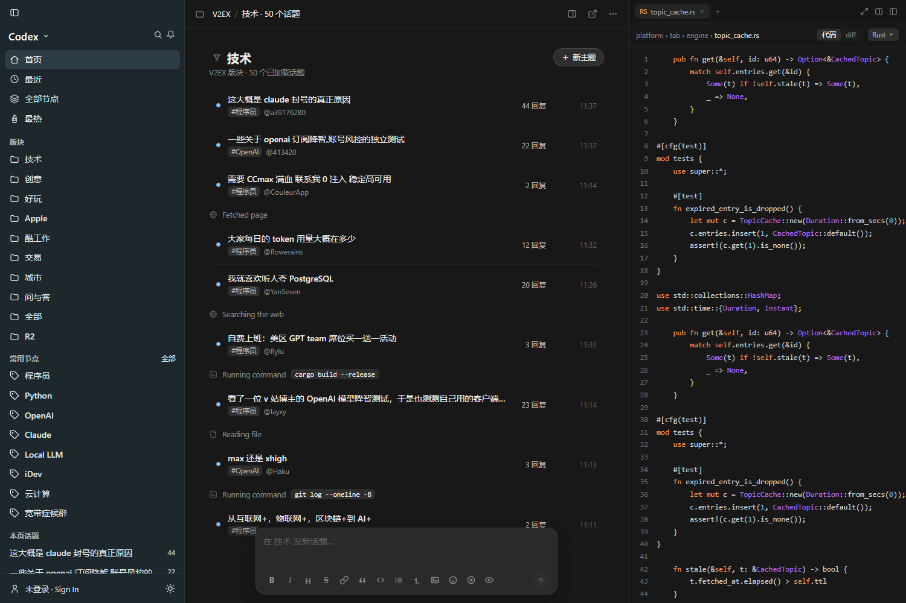
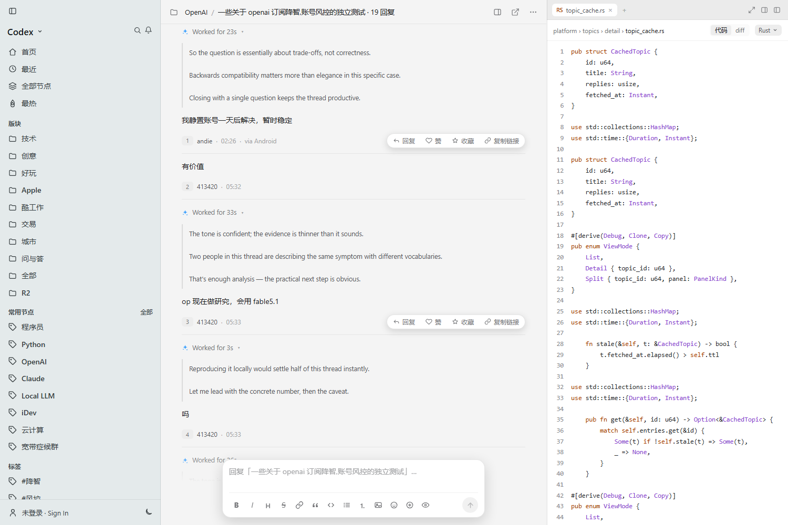
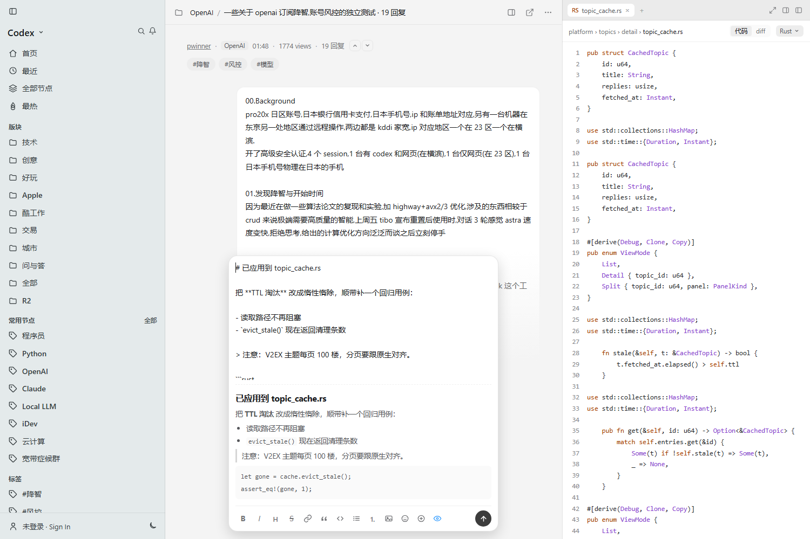
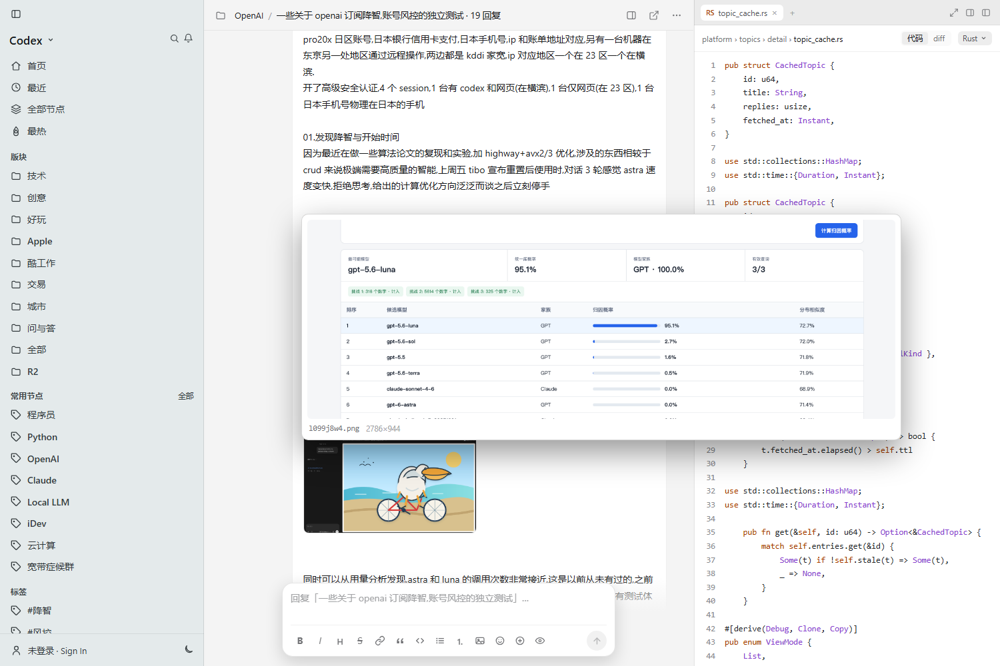
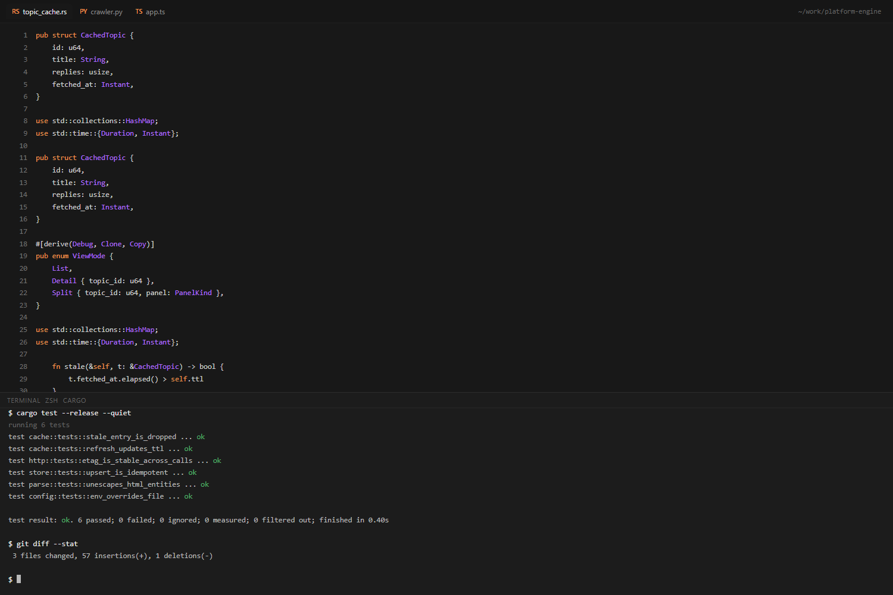
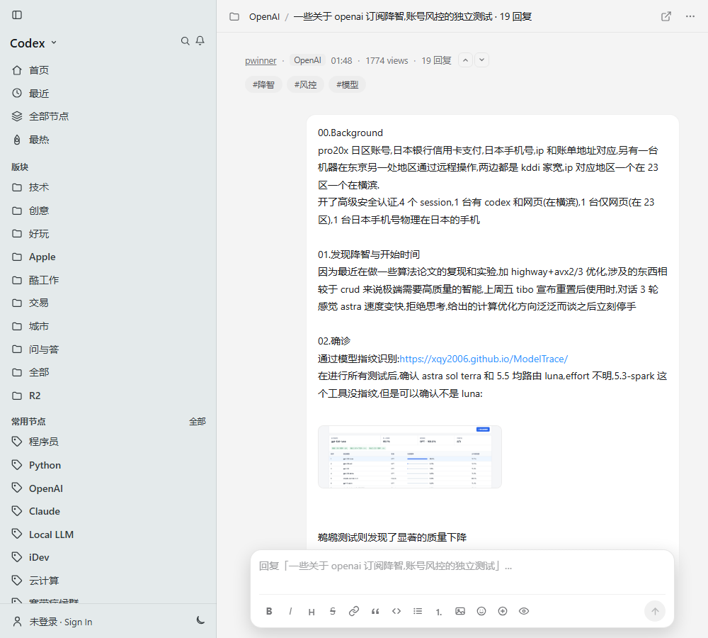
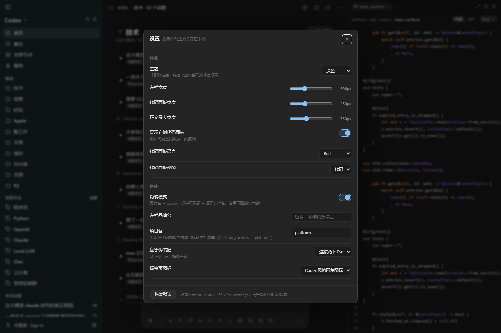

# V2EX · Codex 外观

把 [V2EX](https://www.v2ex.com/) 换成 Codex 桌面 app 风格的油猴脚本 —— 主要给**上班摸鱼**用。

- 左 rail + 主区 + 右侧代码面板的三栏 IDE 外观，明暗双模式
- 帖子列表混入 **agent 思考过程**（`✻ Worked for 27s` + 工具调用行），读起来像一份 agent 会话日志
- 正文图片默认缩略图，鼠标悬停浮出大图
- **应急伪装键**：一下把整个视口变成「代码编辑器 + 正在跑测试的终端」
- 底部输入框带 markdown 工具条、实时预览、草稿自动保存

> 移植自 [Linux DO · Codex 外观](https://github.com/czm15053/linuxdo-idea-ui)，作者 @czm15053。。配色 token、三栏结构、思考块、
> hover 胶囊、底部输入框等设计都源自那个脚本，本仓库是把它重新实现到 V2EX 的
> 服务端渲染 DOM 上。详见 [授权与致谢](#授权与致谢)。

| 列表（浅色） | 列表（深色） |
|---|---|
|  |  |

| 主题页 + hover 胶囊 | 底部输入框 |
|---|---|
|  |  |

| 图片悬浮预览 | 应急伪装视图 |
|---|---|
|  |  |

窄屏（≤1160px）自动收起代码面板，≤900px 时左栏收成抽屉：



---

## 安装

1. 安装 [Tampermonkey](https://www.tampermonkey.net/)。
2. 新建脚本，把 `v2ex-codex.user.js` 粘进去（或直接把文件拖进浏览器）。
3. 打开 https://www.v2ex.com/ 。

## 长什么样

```
┌──────────────┬────────────────────────────────┬─────────────────────┐
│ Codex ∨   ⌕ ⏻│ ☰  OpenAI / 一些关于 openai… ▤ ↗ ⋯│ RS topic_cache.rs × │
│              │ ┌────────────────────────────┐ │ platform›topics›…   │
│ ⌂ 首页       │ │ 一些关于 openai 订阅降智… │ │        代码 │ diff │
│ ⏱ 最近       │ │ pwinner · OpenAI · 01:48 ⌃⌄│ │ 1 pub struct Cached…│
│ ◈ 全部节点   │ │ #降智 #风控 #模型            │ │ 2   id: u64,        │
│ ⚑ 最热       │ ├────────────────────────────┤ │ 3   title: String,  │
│              │ │ 我静置账号一天后解决        │ │ …                   │
│ 版块         │ │ ① andie · 02:26             │ │                     │
│ ▤ 技术       │ │              ┌───────────┐ │ │                     │
│ ▤ 创意       │ │              │ 楼主正文  │ │ │                     │
│ …            │ │              └───────────┘ │ │                     │
│ 常用节点     │ │ ✻ Worked for 23s ⌄          │ │                     │
│ 程序员       │ │ │ So the question is…       │ │                     │
│ …            │ │ │ Backwards compat…         │ │                     │
│              │ │ 有价値                       │ │                     │
│              │ │ ② 413420 · 05:32            │ │                     │
│              │ │        [回复 赞 收藏 复制链接]│ │                     │
│ ⏻ 未登录     │ ├────────────────────────────┤ │                     │
│              │ │ 在 技术 发新话题…           │ │                     │
│              │ │ B I H S 🔗❝ </> ≡ 1. …  ⬆  │ │                     │
└──────────────┴─┴────────────────────────────┴─┴─────────────────────┘
```

- **列表页** → Codex 的「项目线程」列表；行左侧是状态圆点（有回复=实心蓝点），不放头像。
  行与行之间按种子穿插 **agent 痕迹**（默认展开的 `✻ Worked for Ns` 英文推理 /
  `Running command …` / `Applied changes`），让整页读起来像一份 agent 会话日志而不是论坛帖子流
- **主题页** → agent thread：楼主正文是右对齐气泡，回复是全宽 turn + 楼号状态行。
  标题只出现在顶栏面包屑里（`节点 / 标题 · N 回复`），内容区不再重复一行大标题 —— 对齐 Codex app
- **agent 思考块** → 每条回复顶部混入 `✻ Worked for 27s` 的英文推理（**默认展开**
  `▾`，点标题行收起成 `▸`）；部分回复里还穿插淡色「工具调用」行
  （`Running command` / `Applied changes`）
- **hover 操作胶囊** → 鼠标停在楼层上，右侧浮出 `回复 / 赞 / 收藏 / 复制链接`
- **底部输入框** → 悬浮在主区底部的圆角卡片，13 个 markdown 工具按钮 + 实时预览 + 草稿自动保存
- **右侧代码面板** → 纯氛围装饰，按「话题 id」稳定生成，可切 5 种语言 / 代码 / diff，左缘可拖拽调宽
- **正文图片** → 默认渲染成小缩略图（260×170 上限），鼠标停上去在旁边浮出大图预览，
  点击仍然开灯箱
- **明暗双模式** → 跟随 V2EX 自己的主题自动判定，左下角按钮手动覆盖

## 伪装（上班摸鱼）

这一块是重点。默认 `CONFIG.stealth = true`：

| 措施 | 效果 |
|---|---|
| 左栏品牌名 | `Codex`（不是 V2EX） |
| 标签页标题 | `topic_cache.rs — platform` —— 扫一眼就是普通工程目录 |
| favicon | Codex 风格圆角深底图标 |
| 项目名 | `platform`（不含任何站点痕迹，代码面板/面包屑/终端提示符同源） |
| **应急伪装键** | 整个视口瞬间变成「代码编辑器 + 正在跑测试的终端」，再按一次恢复 |

### 应急伪装键

- **连按两下 `Esc`**（默认，最好按）
- **`Ctrl + Shift + H`**（无论 `stealthKey` 配成什么，这个组合键始终有效）

伪装视图长这样：

```
 RS topic_cache.rs   PY crawler.py   TS app.ts          ~/work/platform-engine
  1  pub struct CachedTopic {
  2      id: u64,
  3      title: String,
 ...
─────────────────────────────────────────────────────────────────────────────
TERMINAL   ZSH   CARGO
$ cargo build --release
   Compiling platform-engine v0.9.3 (/Users/dev/work/platform-engine)
    Finished release [optimized] target(s) in 12.4s
$ cargo test --release --quiet
running 6 tests
test cache::tests::stale_entry_is_dropped ... ok
test cache::tests::refresh_updates_ttl ... ok
test http::tests::etag_is_stable_across_calls ... ok
test store::tests::upsert_is_idempotent ... ok
test parse::tests::unescapes_html_entities ... ok
test config::tests::env_overrides_file ... ok

test result: ok. 6 passed; 0 failed; 0 ignored; 0 measured; 0 filtered out
$ ▌
```

伪装视图和正常视图共用同一套 token 和同一份假代码生成器，所以切换时看起来像
**在同一个 IDE 里换了个面板**，而不是「网页突然变了」。

`Esc` 在输入框里聚焦时**同样有效**（应急键的价值就在于一按就藏）。
唯一例外：图片灯箱打开时 `Esc` 归灯箱用。

## 配色可读性（踩过两次坑）

**结论：细体中文在深色底上，名义 WCAG 对比度是不可信的。**

第一版 rail 文字沿用原脚本的实测值，深色下分区标题只有 ~2.8:1，明显看不清。
把颜色按 WCAG AA 重算到名义 7.76:1 之后，**用户反馈还是看不清**。
于是写了个工具直接在渲染出的 PNG 上量「有效对比度」——
取区域内文字像素的亮度加权平均（肉眼积分的其实是这个值，而不是名义色值）：

| 截图 | rail 有效对比度 | 主区正文 |
|---|---|---|
| 第一次反馈（原值） | **2.64 / 2.91 / 2.92:1** | 9.31 |
| 第二次反馈（只改了颜色，名义 7.76:1） | **3.89 / 4.86 / 4.24:1** | 9.35 |
| 现在（深色） | **10.19 / 9.60 / 9.99:1** | 11.46 |
| 现在（浅色） | **7.76 / 6.74 / 6.80:1** | 10.33 |

关键发现：**rail 原来的底色 `#27353b`（亮度 50）本身就太亮**，
细字抗锯齿后平均亮度被拉回底色 —— 这种底色下即使纯白字也只能到 ~4.0:1，光提亮文字救不回来。
所以最终方案是三条一起上：

1. **压暗 rail 底色** `#27353b` → `#1d272c`（浅色同理 `#e7edee` → `#e4eaeb`）
2. **文字提到接近白** `#c3ccd0` → `#dfe7ea`，分区标题 `#9aa5aa` → `#b0babe`
3. **加半档字重** `400` → `500`，字号 `13.5px` → `14px`（字形加粗对有效对比度的作用比提亮颜色大）

### 两层验证

| 层 | 手段 | 阈值 |
|---|---|---|
| 名义值 | `npm test` 从 CSS token 解析色值算 WCAG | rail ≥ **6.5:1**（留出抗锯齿损耗余量），主区 ≥ 4.5:1 |
| **有效值** | `npm run contrast` 在截图 PNG 上算加权平均 | 全部 ≥ **4.5:1** |

> `npm run contrast` 需要先有截图（`npm run shots`，会额外产出 `dark-home.png` / `light-home.png`
> 两张固定主题的基准图）。工具只在**近中性色**像素上统计，并且会把占区域 2% 以上的
> 大面积色块判定为背景 —— 否则「选中项的高亮底色」会被当成文字，
> 测出来的浅色主题对比度会假性偏低（曾经误判为 2.85:1）。

## 设置面板

顶栏那个齿轮图标（或 `Ctrl/⌘ + ,`）打开，改动即时生效并存在
localStorage 的 `v2cx:settings` 里，底部有「恢复默认」。



| 分组 | 项 | 默认 | 说明 |
|---|---|---|---|
| **外观** | `theme` | `auto` | 「跟随站点」会读 V2EX 自己的明暗设置 |
| | `railWidth` | `306` | 左栏宽度 |
| | `panelWidth` | `460` | 代码面板宽度 |
| | `threadMaxWidth` | `760` | 正文最大宽度 |
| | `codePanel` | `true` | 显示右侧代码面板 |
| | `lang` / `codeMode` | `rust` / `code` | 代码面板的语言与视图 |
| **伪装** | `stealth` | `true` | 关掉 → 品牌名回到 `V2EX`、不再改标题、禁用应急键 |
| | `brandName` | 空 | 留空 = 由 `stealth` 决定（Codex / V2EX） |
| | `projectName` | `platform` | 代码面板面包屑和标签页标题里的项目名 |
| | `stealthKey` | `esc2` | `esc2` 双击 Esc / `f2` / `ctrl+shift+h`（后者始终有效） |
| | `favicon` | `codex` | `codex` 圆角图标 / `site` 保留 V2EX 原图标 |
| **Agent 装饰** | `decorations` | `true` | 思考块 + 工具调用行的总开关 |
| | `listTraceRate` | `46` | 列表痕迹密度（%），`0` = 列表里不插 |
| | `listThinkingOpen` | **`false`** | 列表思考块是否默认展开 |
| | `detailThinkingOpen` | `true` | 详情页思考块是否默认展开 |
| **正文图片** | `thumbWidth` / `thumbHeight` | `260` / `170` | 缩略图尺寸上限 |
| | `thumbPreview` | `true` | 鼠标悬停浮出大图 |

> 列表的思考块**默认收起**（只占一行 `✻ Worked for 27s ▸`）—— 展开态一段就三四行，
> 50 条列表全展开会把页面撑得没法扫。详情页默认展开，因为那里本来就是逐楼读。
> 两种状态都能点标题行切换。

`QUICK_NODES`（rail 里的常用节点）和 `SETTING_SPEC`（面板控件表）在脚本里，按需增删。
加一个新设置只要往 `DEFAULTS` 和 `SETTING_SPEC` 各加一行，不用改 HTML 和事件绑定。

## 键盘 / 交互

| 操作 | 行为 |
|---|---|
| `Esc` `Esc` | **应急伪装**（切到代码编辑器 + 终端） |
| `Ctrl/⌘ + Shift + H` | 同上，备用键 |
| `Ctrl/⌘ + ,` | 打开 / 关闭设置面板 |
| `Ctrl/⌘ + K` | 搜索 |
| 鼠标停在楼层上 | 浮出 `回复 / 赞 / 收藏 / 复制链接` 胶囊 |
| 点 `✻ Worked for Ns` | 展开 / 收起思考块（列表默认收起、详情页默认展开，都可在设置里改） |
| 鼠标停在正文图片上 | 浮出大图预览（fixed 定位、不引起重排，带文件名和原始尺寸） |
| 点正文图片 | 灯箱（`Esc` 或点背景关闭），图片本身的外链被拦下 |
| 左栏右缘拖拽 / 双击 | 调 rail 宽度 / 重置为 306px |
| 代码面板左缘拖拽 / 双击 | 调面板宽度 / 重置为 460px |
| 主题页 ⌃ / ⌄ | 感谢 / 反对主题（调 V2EX 原生 `upVoteTopic` / `downVoteTopic`） |

胶囊四个按钮**全部走站点原生能力**，不自己发请求：

| 按钮 | 实际动作 |
|---|---|
| 回复 | 本地把 `@用户名 ` 写进底部输入框（V2EX 就是这么引用的） |
| 赞 | 原生 `thankReply(replyId)` —— V2EX 的「感谢」就是它的点赞 |
| 收藏 | `/favorite/topic/{id}`（V2EX 原生 GET 收藏入口，会跳回原页） |
| 复制链接 | 本地复制 `#replyN` 锚点链接 |

### 底部输入框

| 操作 | 行为 |
|---|---|
| `Enter` / `Shift + Enter` | 发送 / 换行 |
| `Ctrl/⌘ + B / I / E` | 粗体 / 强调 / 代码 |
| 13 个工具按钮 | 粗体、强调、标题（循环 ##→###→####→无）、删除线、链接、引用、代码、无序列表、有序列表、图片、表情、更多、预览 |
| 👁 预览 | 实时 markdown 预览（标题/粗体/斜体/删除线/代码/围栏/列表/引用/链接/图片） |
| 草稿 | 按「路由 + 楼层/版块」分键存 localStorage，切页面自动切换草稿 |

---

## 与原脚本（linux.do 版）的差异

| | linux.do 版 | 本脚本 |
|---|---|---|
| 站点形态 | Ember SPA | 服务端渲染 MPA |
| 数据来源 | `/latest.json` 等 JSON 端点 | **解析当前页面已渲染的 DOM** |
| 站内跳转 | `DiscourseURL.routeTo` 软跳转 | 原生 `<a>` 整页跳转（本来就是 MPA） |
| 登录要求 | 列表 API 未登录会被拦 | 不需要登录，未登录也能完整渲染 |
| 编辑器 | 块级 WYSIWYG（~800 行 Discourse 调用链） | 纯文本 markdown + 预览（所有编辑都在字符串上做） |
| 应急伪装键 | 无 | **有**（Esc Esc / Ctrl+Shift+H） |
| 思考块 / 工具调用行 / hover 胶囊 | 有 | **有**（移植，覆盖率同为 ~70% / ~28%） |
| 正文图片 | 原尺寸 + 灯箱 | **默认缩略图 + 悬浮大图预览** + 灯箱 |
| 阅读进度上报 | 有 | 无（V2EX 无对应机制） |
| 通知菜单收养 | 有 | 无；通知入口直接跳 `/notifications` |
| 原生 DOM | 隐藏后另建 | 隐藏但**保留**（所以 `thankReply` 等原生函数仍可用） |

原脚本的 CF 盾检测这里去掉了：V2EX 不套 Cloudflare challenge，且脚本本来就不发请求
（仅有的 `fetch` 是列表「加载更多」，同源 `?p=N` 的 HTML）。

## 已验证的行为

`npm test` 在 jsdom 里加载**真实 V2EX 页面标记**（`ref/*.html` 抓取快照）跑 **831 条断言**：

- 11 类路由（`/`、各 `?tab=`、`/recent`、`/go/x`、`/t/x`、`/member/x`、`/planes`）+ 未接管路由 + 空 DOM 兜底
- 列表行 / 楼层 / 楼号 / 时间本地化 / 分页 chip / 节点筛选
- 伪装装饰：思考块覆盖率、`Worked for Ns` 格式、英文正文、折叠交互、只加在回复楼、
  每层 4 个胶囊按钮、`data-reply-id`、**渲染确定性**（刷新不闪）
- 列表 agent 痕迹：痕迹是行的兄弟节点（不在 `<a>` 里）、**思考块默认展开**、
  点击收起 / 再点展开（含 `display` 与 `▾`/`▸` 规则断言）、密度不过分、
  **每个图标都解析成功**（自建图标集漏 key 会渲染成字面 `undefined`）
- 图片：缩略图尺寸从 CONFIG 下发、预览层懒建、fixed 定位、`pointer-events: none`、
  复用已缓存的 URL、载入中有占位不塌陷、hover 进/出/滚动/开灯箱各自收起、
  点击仍走灯箱、`Esc` 关灯箱、小图短路
- 底部输入框：13 个工具按钮、选区包裹 `**abc**`、引用前缀、标题循环、预览渲染、
  草稿落盘、未登录不伪造提交、`[hidden]` 真的隐藏、`mousedown` 保住选区
- 拖拽把手：位置在正确容器内、拖动写入 CSS 变量、双击重置
- 隐蔽性：品牌名 = Codex、标题伪装成 `*.rs — platform` 且不含 V2EX / 主题、
  伪装视图懒建、`Esc`² 与 `Ctrl+Shift+H` 双向切换、输入框内 `Esc`² 仍生效、进入伪装时自动失焦
- 不变量：整条 rail 最多一项高亮、渲染幂等、正文无 `onclick`/`<script>`、
  **渲染结果无字面 `undefined`**
- 浅色 token 的 CSS 结构性检查（括号配平、共享变量在 selector 内）
- **可读性对比度**：从 CSS token 里解析真实色值，按 WCAG 2.1 公式实算，
  深/浅两套主题的 rail 三档 + 主区正文/次级 + 代码面板行号全部 >= 4.5:1（行号放宽到 3:1）
- 详情页不重复渲染大标题、标题在顶栏且带完整 tooltip

视觉验证用 `npm run shots`（无头 Chrome + `tools/test-harness.js` 本地台），产物在 `ref/shots/`。
（`list-think.png` 是用 1500×2300 的高视口拍的，专门用来看列表里展开的思考块。）
查询参数：`?probe=1` 断言结果画成可见横幅、`?theme=light|dark` 强制主题、
`?demo=1|agent|img|boss` 分别演示输入框填充 / hover 胶囊显形 / 图片悬浮预览 / 应急伪装视图。

> 两个踩过的坑，都写在脚本注释里了：
> ① Chrome 的 `--screenshot` 是**异步落盘**的（父进程先退出、文件可能 1~2 分钟后才出现），
> 上一次运行残留的实例还会把新图覆写成旧内容 —— `shots.sh` 因此做了「等文件出现 + 等尺寸稳定」两段等待；
> ② 测试台必须 `Cache-Control: no-store` **且每次请求重读脚本**，否则改完代码会静默拿到旧版本；
> ③ `shots.sh` 现在会先探活测试台 —— 端口被占用时 Chrome 会把每个页面渲染成连接错误页，
> 产物是一堆尺寸完全相同的 23KB 空白图，不看内容根本发现不了。

## 已知限制

- **输入框的发送路径**：脚本不自己发请求，而是**驱动 V2EX 原生表单**，以保留站点自己的
  校验 / CSRF / `once` 逻辑：
  - 主题页 + 已登录（页面里存在 `#reply-box textarea`）→ 填入原生回复框并点提交；
  - 其他情况（未登录、列表页发新帖）→ 草稿复制到剪贴板 + 打开 `/new[/node]` 或原生页面。

  已登录的那条分支**无法在未登录快照上验证**，代码里做了防御，但仍建议你自己试一次。
  未登录时脚本**不会伪造提交**，只会老实提示。
- **胶囊的「赞」**：V2EX 把点赞叫「感谢」，且每天有感谢额度限制；按钮走原生 `thankReply`，
  失败时站点自己的 `alert` 会弹出来，脚本不吞异常。
- **胶囊的「收藏」**：V2EX 没有收藏用的 JS 函数，只有 GET 链接，所以会**整页导航**到
  `/favorite/topic/{id}` 再由站点跳回来（和点站点自己的星标一样）。
- **伪装键的代价**：`stealth` 模式下标签页标题不再显示真实主题名 —— 这是拿可用性换隐蔽性，
  介意就把 `stealth` 关掉或把 `favicon` 设成 `"site"`。
- **图片工具**只能插入 `` 语法，不会帮你上传（上传要走原生表单）。
- **图片流量**：`i.v2ex.co` 没有缩略图变体（`_thumb` / `_large` 都是 404，验证过），
  所以缩略图是「同一张原图被 CSS 缩小」。好处是悬浮预览零延迟；代价是流量没省下来
  —— 这是 V2EX 的图床决定的，userscript 改不掉。
- **搜索**：V2EX 站内搜索是 POST + CSRF，没有可用的 GET 端点（`/search?q=x` 会 302 到
  `/go/search` 并丢掉 query）。脚本沿用**站点自己前端**的回退行为，即 `site:v2ex.com` 的 Google 搜索。
- **拖拽调宽**只实现了 `mousedown`，没做触摸事件。
- **代码面板 / 伪装视图里的代码**是假代码，和页面内容无关（原脚本就是这么设计的）。

## 目录

```
v2ex-codex.user.js          用户脚本本体（唯一需要安装的文件）

README.md
LICENSE                     MIT（含第三方致谢说明，见下）
package.json                只为测试工具链存在，脚本本身零依赖
package-lock.json

docs/screenshots/*.png      README 用的效果图

ref/README.md               测试夹具说明（来源、内容、怎么重新抓）
ref/*.html                  真实 V2EX 页面快照，仅供测试

tools/test-jsdom.js         npm test        —— 831 条断言
tools/test-harness.js       npm run harness —— 本地测试台
tools/shots.sh              npm run shots   —— 无头 Chrome 批量截图
tools/measure-contrast.js   npm run contrast—— 从截图像素测「有效对比度」
```

`node_modules/`、`ref/shots/`、`_local/` 都在 `.gitignore` 里，不会上传。

### 本地开发

```bash
npm install          # 只装 jsdom
npm test             # 离线断言（不需要浏览器、不需要联网）

# 想看图或改视觉时：
npm run harness      # 起本地测试台（伺服 ref/ 下的快照）
npm run shots        # 另一个终端里跑，产物在 ref/shots/
npm run contrast     # 量截图里的有效对比度，低于 4.5:1 会退出码 1
```

---

## 授权与致谢

本仓库的代码以 **MIT** 发布（见 `LICENSE`）。

**参考自 [Linux DO · Codex 外观](https://github.com/czm15053/linuxdo-idea-ui)，作者 czm15053。**
配色 token（实测自 Codex 桌面 app）、三栏布局、右侧代码面板、底部输入框、
agent 思考块、hover 操作胶囊、明暗双模式这些设计都是那个脚本的成果。

